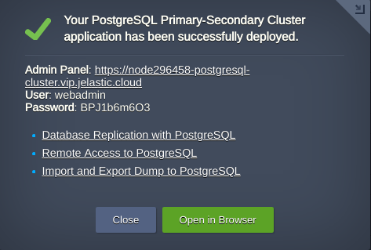

# PostgreSQL Database Replication

Basic ready-to-use PostgreSQL cluster, which implements asynchronous master-slave data replication within a pair of preconfigured database containers.

## Package Implementation Specifics

The presented PostgreSQL Replication solution is built upon Jelastic certified stack template for **PostgreSQL 9.5.5**. It operates two database containers (master and slave, one per role) and makes data from primary DB server to be asynchronously replicated to a standby one.

Within the package, each database container receives the [vertical scaling](https://docs.jelastic.com/automatic-vertical-scaling) up to **24 dynamic cloudlets** (or 3 GiB of RAM and 9.6 GHz of CPU) that are provided dynamically based on the incoming load. Subsequently, you can change the resource allocation limit by following the above-linked guide.

## How to Install PostgreSQL Database Replication Package

In order to get PostgreSQL Database Replication solution instantly deployed, click the **Deploy to Jelastic** button below and specify your email address within the opened widget. Then choose one of the [Jelastic Public Cloud](https://jelastic.cloud) providers (in case you don’t have an account at the appropriate platform, it will be created automatically) and press **Install**.

To install the package manually, log in to the Jelastic dashboard with your credentials and [import](https://docs.jelastic.com/environment-import) link to the [**_manifest.yaml_**](https://github.com/jelastic-jps/postgres/blob/master/manifest.yaml) file (alternatively, you can locate this package via [Jelastic Marketplace](https://docs.jelastic.com/marketplace), *Clusters* section)

Within the opened installation window, type *Environment* name and optional *Display Name* ([environment alias](https://docs.jelastic.com/environment-aliases)). Also, select the preferable [*Region*](https://docs.jelastic.com/environment-regions) (if several ones are available) and click **Install**.

Wait a few minutes for Jelastic to prepare your environment and set up the required replication configurations. When finished, you’ll be shown the appropriate notification with data for PostgreSQL administration interface access. 

This information will be also duplicated to you via email.

To find more details on PostgreSQL Replication package installation and use, refer to the [article](http://blog.jelastic.com/2017/05/25/master-slave-postgresql-replication-automatic-installation/).
